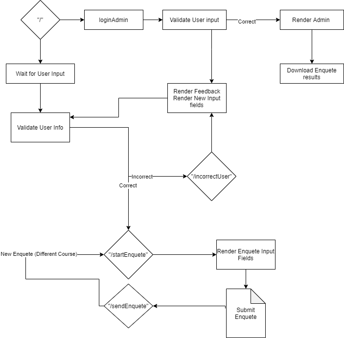
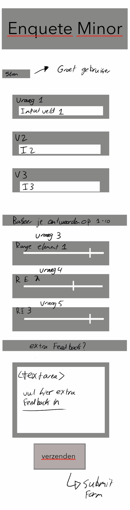
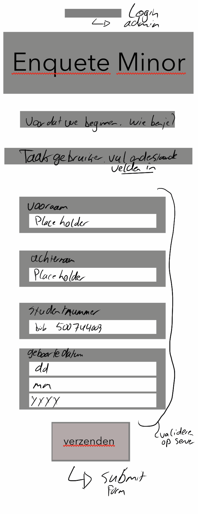
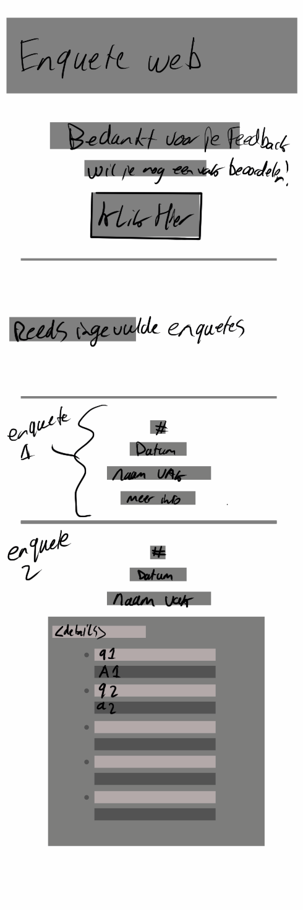
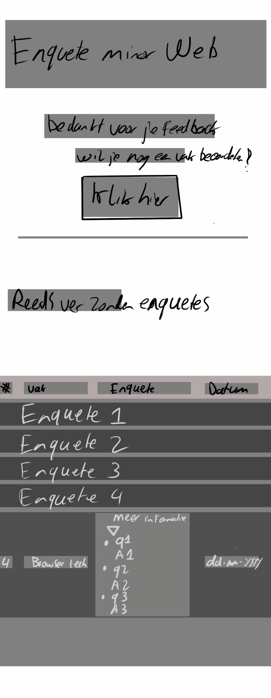
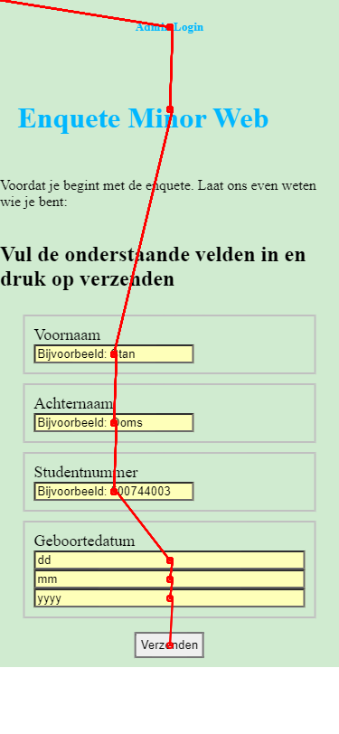
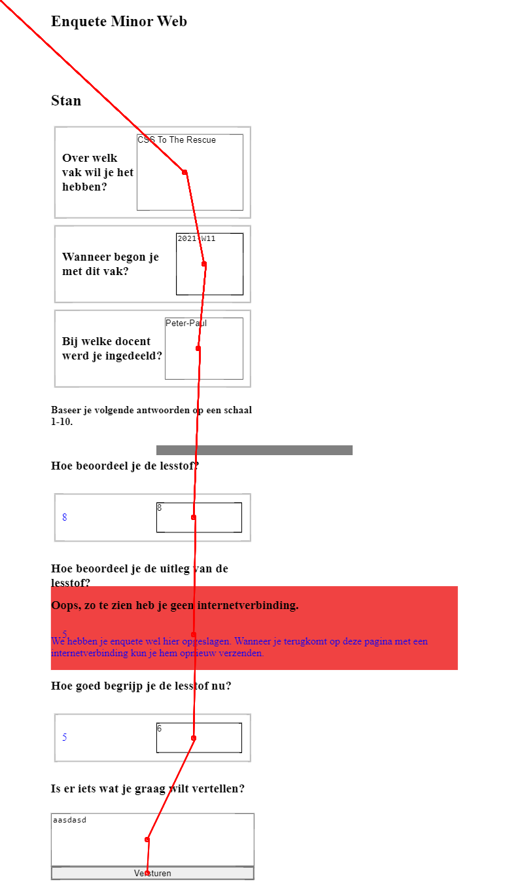

# Eindopdracht

[Live Demo](https://BT2021.herokuapp.com)

# Inhoudsopgave

## Use Case

Ik heb gekozen voor de enquete als use case.
De enquete gaat over de minor Web Development van de Hogeschool van Amsterdam.

**Core Functionaliteit**: _"Ik wil een enquête kunnen invullen over de minor Web Development, met verschillende antwoordmogelijkheden. Als ik de enquête niet afkrijg, wil ik later weer verder gaan met waar ik ben gebleven."_

## Samenvatting

### De opdracht is gemaakt met de volgende technieken:

- NodeJS
- Express
- POST request
- Server Side Rendering
- Hidden Input Fields
- Progressive enhancement

### Verificatie

De verificatie van een user vindt plaats in de volgende stappen:

1. Gebruiker vult basisgegevens in.
2. Gegevens worden vergeleken met reeds bekende informatie op de server.
3. Indien de gebruikersinput matched met de bekende gegevens gaat met door naar het enquete scherm. Indien de gebruikersinput niet matched met de bekende gegevens wordt de user doorverwezen naar een pagina waar hiervan feedback wordt getoont.

# Browsers

#### De applicatie wordt getest in de volgende Browsers:

- Chrome, Desktop + Mobiel **Versie 89.0.4389.82 (Officiële build) (64-bits)**
- Firefox, Desktop **Versie 86.0.1 (64-bit)**
- Safari Ipad **Versie 14.0**
- Samsung Internet, Mobiel **Versie 13.2.3.2**

# Interaction Diagram

# Wireflow

#### Wireflow Progressive Enhanced Index Page

#### Wireflow Progressive Enhanced Enquete Page

#### Wireflow Progressive Enhanced Finished Page Mobile

- Here the _Previous enquetes_ section is not a table.

#### Wireflow Progressive Enhanced Finished Page screen Tableview ( screen.width > 380px )

- Here the _Previous enquetes_ section is changed to a table for clear viewing purposes.

## CheckList

- [x] Voeg 'fallbacks' toe voor elke geteste browser.

- [x] Chrome
- [x] Firefox
- [x] Safari
- [x] Samsung Internet

**Functional Layer**

- [x] Maak alle HTML compleet
- [x] "save" progress using only HTML [Browser Support](https://caniuse.com/?search=autocomplete)

Doordat Server side rendering plaatsvind is de site te gebruiken vanaf de _functional_ layer. Hierbij is dus GEEN CSS en JS toegepast.

**Useable Layer**

- [x] Voeg CSS toe.
- [x] Landscape Modus
- [x] :focus. Focus pseudoclass is gebruikt om inputvelden duidelijker en herkenbaarder te maken.
- - CSS Flexible Box Layout Module [Browser Support](https://caniuse.com/flexbox)

**Pleasurable Layer**

- [x] Progressively enhance enquete UI met `<input type="range">` elementen. Geef hierbij een extra element die het voor de gebruiker duidelijk maakt om het input element goed te gebruiken. Dit element laat de huidige waarde zien van het `<input type="range">` element. [Browser Support](https://caniuse.com/input-range).
      `<input type="range">` elementen zijn van nature niet user-friendly. Ik vervang de `<input type"radio">` elementen pas nadat het zeker is dat `javascript` aan staat. Hierdoor kan naast een `<input type="range">` ook extra user feedback worden getoond.

- [x] Vervang `<input type"date">` door:

`<input type="number" name="dd">`

`<input type="number" name="mm">`

`<input type="number" name="yyyy">`

_"De UK Government Digital Services raad het gebruik van `<input type="date">` niet aan vanwege problemen die zij ondervonden bij hun gebruikerstest"_(1)

- [x] Progress Bar [Browser Support](https://caniuse.com/?search=onScroll)

# Testing

Tijdens het testen ontdekte ik dat `<input type="week">` niet ondersteunt wordt door Firefox browsers. Daarom heb ik dit aangepast naar de volgende stuctuur: `<select><option></select>`.

!! 30-03-2021: Op dit moment heb ik deze feature uitgeschakeld wegens een slecht native `<input type="date">` element op Safari.

## HTML Validator

Ik heb gebruik gemaakt van de [HTML validation tool](https://validator.w3.org/). De volgende 3 paginas zijn hiermee gecontroleerd en vervolgens geoptimaliseerd totdat de semantiek volgens deze tool optimaal was:

- "/" (indexpagina)
- "/startEnquete" (daadwerkelijke enquete)
- "/sendEnquete" (Enquete verzonden. Overzichtspagina reeds verzonden enquetes)

---

## Tab Accessability

De volgende afbeeldingen zijn gemaakt met de [Chromelens Chrome Extension](https://chrome.google.com/webstore/detail/chromelens/idikgljglpfilbhaboonnpnnincjhjkd)

1. Tab path bij uitgeschakelde CSS op de index pagina.

2. Tab Path bij volledige enhancement op enquete pagina

3. Tab Path bij volledige enhancement op enquete verzonden ("/sendEnquete") pagina. Deze afbeelding is ingekort i.v.m. de lengte van de pagina. Het bereik van het 'tabben' kwam t/m de laatste reeds verzonden enquetes `
` element.

---

Ook wanneer CSS en JS uitgeschakeld zijn blijft de pagina volledig tab-baar. De gebruiker is nog steeds in staat dezelfde functionaliteiten te gebruiken.

# Referenties

1. Making input type=date complicated. Peter-Paul Koch. Medium. 17-01-2017. https://medium.com/samsung-internet-dev/making-input-type-date-complicated-a544fd27c45a

2. 3 Layers of Progressive Enhancement. Luna May. Medium. 04-07-2019. https://medium.com/@lunamayjohansson/3-layers-of-progressive-enhancement-84ec77424694
