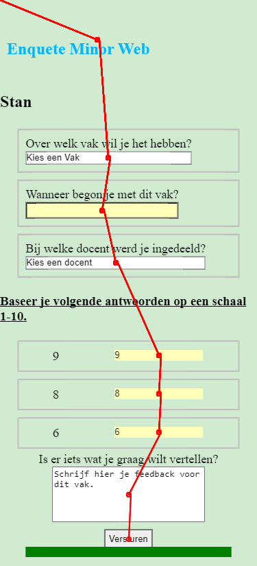
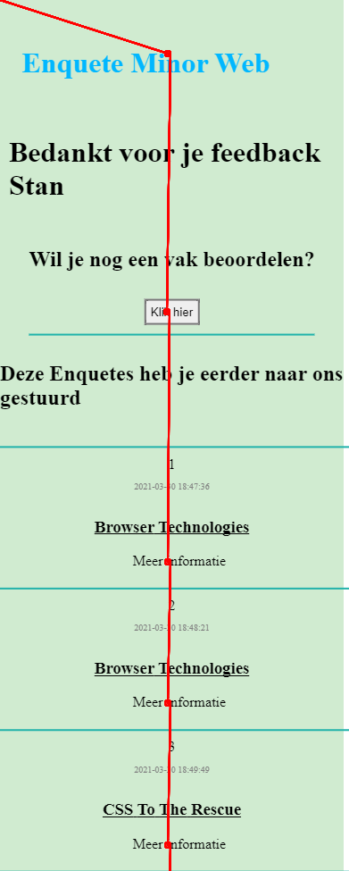
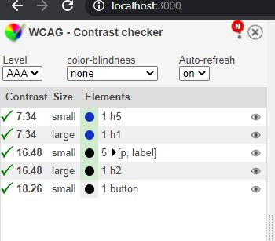

# Eindopdracht

[Live Demo](https://BT2021.herokuapp.com)

De demo kan gebruikt worden door op de bovenstaande link te klikken, de volgende gegevens in te vullen en op verzenden te klikken:

Voornaam: Stan

Achternaam: Ooms

Studentnummer: 500744003

Geboortedatum 23-06-1996

# Feature detection

Feature detection is het controleren of een bepaalde feature op het toestel van de gebruiker ondersteund wordt alvorens er op gehandeld wordt. Hierdoor is het mogelijk om op een efficiente manier progressive enhancement toe te passen.

Ik maak gebruik van feature detection in de directory: `public/javascripts/main.js`

Dit is te zien aan het volgende code block:

` if ("localStorage" in window) { localStorageFeature(); }`

## Use Case

Ik heb gekozen voor de enquete als use case.
De enquete gaat over de minor Web Development van de Hogeschool van Amsterdam.

**Core Functionaliteit**: _"Ik wil een enquête kunnen invullen over de minor Web Development, met verschillende antwoordmogelijkheden. Als ik de enquête niet afkrijg, wil ik later weer verder gaan met waar ik ben gebleven."_

## Progressive Enhancement

Wat zijn de core principes van progressive enhancement? (3)

- Basis _functionaliteit_ moet beschikbaar zijn voor _alle web browsers_
- Alle content zit in _semantische HTML_
- Een _Enhanced layout_ is beschikbaar via extern gelinkte _CSS_.
- _Enhanced gedrag_ is beschikbaar via een onopvallende, extern gelinkt _Javascript_
- De _voorkeursinstellingen_ van de browsers van eindgebruikers worden _gerespecteerd_.

### De opdracht is gemaakt met maar niet beperkt tot de volgende technieken:

- NodeJS
- Express
- POST request
- Server Side Rendering
- Hidden Input Fields
- Progressive enhancement

### Verificatie

De verificatie van een user vindt plaats in de volgende stappen:

1. Gebruiker vult basisgegevens in.
2. Gegevens worden vergeleken met reeds bekende informatie op de server.
3. Indien de gebruikersinput matched met de bekende gegevens gaat met door naar het enquete scherm. Indien de gebruikersinput niet matched met de bekende gegevens wordt de user doorverwezen naar een pagina waar hiervan feedback wordt getoont.

# Browsers

#### De applicatie is getest in de volgende Browsers:

- Chrome, Desktop + Mobiel **Versie 89.0.4389.82 (Officiële build) (64-bits)**
- Firefox, Desktop **Versie 86.0.1 (64-bit)**
- Safari Ipad **Versie 14.0**
- Samsung Internet, Mobiel **Versie 13.2.3.2**

# Interaction Diagram

# Wireflow

#### Wireflow Progressive Enhanced Index Page

#### Wireflow Progressive Enhanced Enquete Page

#### Wireflow Progressive Enhanced Finished Page Mobile

- Hier is de _Previous enquetes_ sectie geen tabel. Ik heb hiervoor gekozen omdat de tabel in dit geval op mobiel geen goed leesbare layout bood.

#### Wireflow Progressive Enhanced Finished Page screen Tableview ( screen.width > 380px )

- Hier heb ik de _previous enquetes_ sectie op grotere schermen gewijzigd naar een tabel zodat het duidelijker uit te vouwen en te lezen is.

## CheckList

- [x] Test elke browser en maak aanpassingen indien nodig.

- [x] Chrome
- [x] Firefox
- [x] Safari
- [x] Samsung Internet

**Functional Layer**

- [x] Maak alle HTML compleet
- [x] "save" progress using only HTML [Browser Support](https://caniuse.com/?search=autocomplete)

Doordat Server side rendering plaatsvind is de site te gebruiken vanaf de _functional_ layer. Hierbij is dus GEEN CSS en JS toegepast.

**Useable Layer**

- [x] Voeg CSS toe.
- [x] Landscape Modus
- [x] :focus. Focus pseudoclass is gebruikt om inputvelden duidelijker en herkenbaarder te maken.
- - CSS Flexible Box Layout Module [Browser Support](https://caniuse.com/flexbox)

**Pleasurable Layer**

- [x] Progressively enhance enquete UI met `<input type="range">` elementen. Geef hierbij een extra element die het voor de gebruiker duidelijk maakt om het input element goed te gebruiken. Dit element laat de huidige waarde zien van het `<input type="range">` element.
      `<input type="range">` elementen zijn van nature niet user-friendly. Ik vervang de `<input type"radio">` elementen pas nadat het zeker is dat `javascript` aan staat. Hierdoor kan naast een `<input type="range">` ook extra user feedback worden getoond.

- [x] Vervang `<input type"date">` door:

`<input type="number" name="dd">`
`<input type="number" name="mm">`
`<input type="number" name="yyyy">`

_"De UK Government Digital Services raad het gebruik van `<input type="date">` niet aan vanwege problemen die zij ondervonden bij hun gebruikerstest"_(1)

[Browser Support](https://caniuse.com/input-range).

- [x] Progress Bar [Browser Support](https://caniuse.com/?search=onScroll)

# Browser tests

- Tijdens het testen ontdekte ik dat `<input type="week">` niet ondersteunt wordt door Firefox browsers. Daarom heb ik dit aangepast naar de volgende stuctuur: `<select><option></select>`.

- Tijdens het testen op Safari ontdekte ik dat het native element `<input type="date">` niet geschikt is om een geboortedatum mee in te vullen. Daarom heb ik gekozen om 3 alternatieve velden te gebruiken.

Tijdens het testen heb ik verschillende tools gebruikt om mij te ondersteunen in het vinden van fouten m.b.t. contrast, leesbaarheid, toetsenbord-vriendelijkheid en HTML semantiek.
Regelmatig moest ik aanpassingen doen om dit te optimaliseren. Ik heb ervoor gezorgd dat mijn website en de paginas die betrekking hebben op de core-functionaliteit voldoen aan de eisen die deze onderwerpen stellen.

Hier ga ik in de onderdelen hieronder verder op in met afbeeldingen van de scores.

---

## HTML Validator

Ik heb gebruik gemaakt van de [HTML validation tool](https://validator.w3.org/). De volgende 3 paginas zijn hiermee gecontroleerd en vervolgens geoptimaliseerd totdat de semantiek volgens deze tool optimaal was:

- "/" (indexpagina)
- "/startEnquete" (daadwerkelijke enquete)
- "/sendEnquete" (Enquete verzonden. Overzichtspagina reeds verzonden enquetes)

Ter validatie hiervan kunt u de HTML copy + pasten in de Tool hierboven beschreven.

---

## Tab Accessability

De volgende afbeeldingen zijn gemaakt met de [Chromelens Chrome Extension](https://chrome.google.com/webstore/detail/chromelens/idikgljglpfilbhaboonnpnnincjhjkd)

1. Tab path bij uitgeschakelde CSS op de index pagina.

2. Tab Path bij volledige enhancement op enquete pagina

3. Tab Path bij volledige enhancement op enquete verzonden ("/sendEnquete") pagina. Deze afbeelding is ingekort i.v.m. de lengte van de pagina. Het bereik van het 'tabben' kwam t/m de laatste reeds verzonden enquetes `
` element.

---

Ook wanneer CSS en JS uitgeschakeld zijn blijft de pagina volledig tab-baar. De gebruiker is nog steeds in staat dezelfde functionaliteiten te gebruiken.

## Contrast Checker

Deze website is conform WCAG 2.0 AAA. Dit is gecontroleerd met de hiervoor bestemde [Chrome Extensie](https://chrome.google.com/webstore/detail/wcag-color-contrast-check/plnahcmalebffmaghcpcmpaciebdhgdf)

- Contrast check bij volledige enhancement indexpagina

- Contrast check bij volledige enhancement enquete pagina

- Contrast check bij volledige enhancement finished pagina

# Referenties

1. Making input type=date complicated. Peter-Paul Koch. Medium. 17-01-2017. https://medium.com/samsung-internet-dev/making-input-type-date-complicated-a544fd27c45a

2. 3 Layers of Progressive Enhancement. Luna May. Medium. 04-07-2019. https://medium.com/@lunamayjohansson/3-layers-of-progressive-enhancement-84ec77424694

3. What is Progressive Enhancement, and why it matters. Praveen Dubey. Freecodecamp. 26-11-2018. https://www.freecodecamp.org/news/what-is-progressive-enhancement-and-why-it-matters-e80c7aaf834a/
